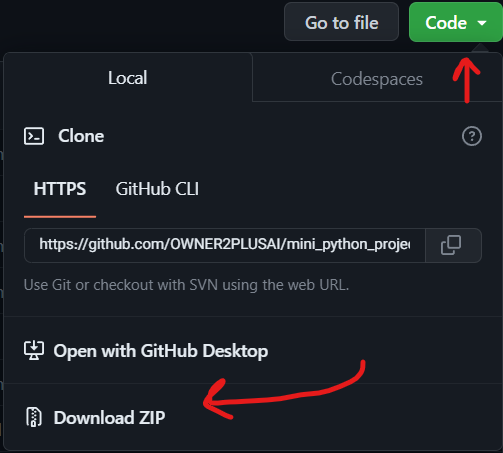

4
  <kbd>
    
  </kbd>

SR No   | Project |
--- | --- |
1 | [PY to EXE](https://github.com/AsmrCodeZ-YT/mini_python_projects/tree/main/01__.py%20to%20.exre) 
2 | [Angel Finder cv](https://github.com/AsmrCodeZ-YT/mini_python_projects/tree/main/02__Angel%20Finder_cv) 
3 | [Audio Labrary](https://github.com/AsmrCodeZ-YT/mini_python_projects/tree/main/03__audioLabrary) 
4 | [calculator](https://github.com/AsmrCodeZ-YT/mini_python_projects/tree/main/04__calculator) 
5 | [Clock](https://github.com/AsmrCodeZ-YT/mini_python_projects/tree/main/05__clock) 
6 | [Color Map](https://github.com/AsmrCodeZ-YT/mini_python_projects/tree/main/06__Color%20map) 
7 | [CountDown](https://github.com/AsmrCodeZ-YT/mini_python_projects/tree/main/07__countdown) 
8 | [Crop Image](https://github.com/AsmrCodeZ-YT/mini_python_projects/tree/main/08__Crop_image) 
9 | [Image to Cartoon](https://github.com/AsmrCodeZ-YT/mini_python_projects/tree/main/09__Image2Cartoon) 
10 | [IP Address Tkinter](https://github.com/AsmrCodeZ-YT/mini_python_projects/tree/main/10__ip%20Address%20tkinter) 
11 | [KeyWord Finder](https://github.com/AsmrCodeZ-YT/mini_python_projects/tree/main/11__Keyword_finder) 
12 | [Mark Detection](https://github.com/AsmrCodeZ-YT/mini_python_projects/tree/main/12__Marker_detection) 
13 | [Mark Generator](https://github.com/AsmrCodeZ-YT/mini_python_projects/tree/main/13__Marker_generator) 
14 | [MP4 to MP3](https://github.com/AsmrCodeZ-YT/mini_python_projects/tree/main/14__MP4%20TO%20MP3) 
15 | [Music Player](https://github.com/AsmrCodeZ-YT/mini_python_projects/tree/main/15__Musicplayer) 
16 | [PDF2TEXT](https://github.com/AsmrCodeZ-YT/mini_python_projects/tree/main/16__PDF%202%20TxT) 
17 | [QRcode Gen Tkinter](https://github.com/AsmrCodeZ-YT/mini_python_projects/tree/main/17__QRcode%20Gen%20_%20tkinter) 
18 | [Random PassWord](https://github.com/AsmrCodeZ-YT/mini_python_projects/tree/main/18__Random%20PassWord) 
19 | [Remove BackGround](https://github.com/AsmrCodeZ-YT/mini_python_projects/tree/main/19__remove_background) 
20 | [Road Detection](https://github.com/AsmrCodeZ-YT/mini_python_projects/tree/main/20__RoadDetection_cv) 
21 | [Subtitle Translator](https://github.com/AsmrCodeZ-YT/mini_python_projects/tree/main/22__Trasnlate_subtitle) 
22 | [WebCam Free](https://github.com/AsmrCodeZ-YT/mini_python_projects/tree/main/23__WebCam_free) 
23 | [WebCam Remove BG](https://github.com/AsmrCodeZ-YT/mini_python_projects/tree/main/24__webcam_remove_background) 

### How can I read this tutorial without an Internet connection? 

1. Go [**`here`**](https://github.com/OWNER2PLUSAI/mini_python_projects) and click the big green ➞ **`Code`** button in the top right of the page, then click ➞ [**`Download ZIP`**](https://github.com/OWNER2PLUSAI/mini_python_projects/archive/refs/heads/main.zip).

    

2. Extract the ZIP and open it. Unfortunately I don't have any more specific instructions because how exactly this is done depends on which operating system you run.
    
3. Launch ipython notebook from the folder which contains the notebooks. Open each one of them
  
    **`Kernel > Restart & Clear Output`**
    
This will clear all the outputs and now you can understand each statement and learn interactively.

If you have git and you know how to use it, you can also clone the repository instead of downloading a zip and extracting it. An advantage with doing it this way is that you don't need to download the whole tutorial again to get the latest version of it, all you need to do is to pull with git and run ipython notebook again.

---

## Authors ✍️

I'm Dr. OMID Ebrahimi and I have written this tutorial.
If you like this tutorial, please give it a ⭐ star.

---

## Licence 📜

You may use this tutorial freely at your own risk. See [LICENSE](./LICENSE).
