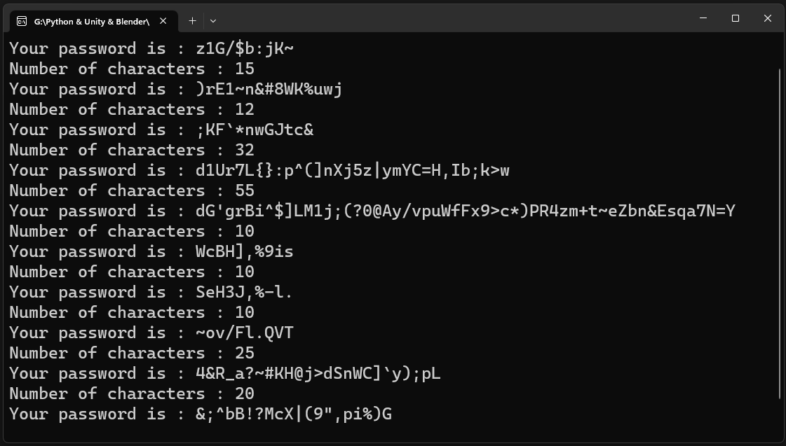

# **PassWord Generator**

## 

```python

def password():
    
    password =  string.ascii_letters + string.digits + string.punctuation

    len_ = input("Number of characters : ")
    int_len = int(len_)
    password2 = "".join(random.sample(password , int_len))
    print("Your password is : " + password2)
    

while True:
    password()
    
```
